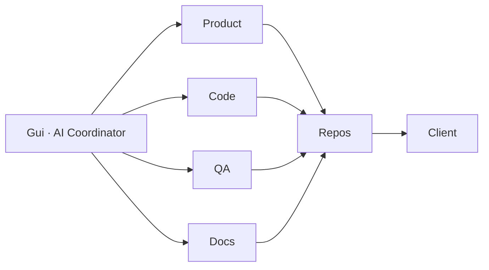

# Guilherme / Gui — AI Coordinator

Coordeno agentes de IA para produtos digitais. 
**EN:** AI Coordinator — I orchestrate AI agents so work lands cleanly in the world. Human direction. Versioned repos. Clear acceptance.

---

## On-demand (this week)

Landing, SaaS template clone, branding, PDF/proposals, focused fixes.

| Package | Typical delivery |
|--------|------------------|
| Landing / client site | 24–72h |
| Clone + brand of `comercial-template` | 2–5 days |
| Bugfix / short feature | 1–3 days |

**How to hire:** open an [issue](https://github.com/lughlammas/comercial-template/issues) with scope and deadline. No briefing → no proposal.

---

## Languages

| Language | Level |
|----------|--------|
| Portuguese | Native |
| English | Fluent |
| Spanish | Fluent |
| Japanese | Learning |
| Hebrew | Learning |

---

## Flagship (lab)

| Project | What it is | Links |
|---------|------------|-------|
| **Sherlock** | Visual chess investigation desk on home UCI engine **Lughnasadh**. Training / analysis only — not live cheat. | [repo](https://github.com/lughlammas/sherlock) · [APK 0.1.3](https://github.com/lughlammas/sherlock/releases/tag/v0.1.3) |
| **Tron — o legado** | Android + web lab app (chess investigation UI lineage). | [repo](https://github.com/lughlammas/tron-o-legado) · [APK 0.2.0](https://github.com/lughlammas/tron-o-legado/releases/tag/v0.2.0) |
| **Êxodus** | Free Android file manager (MIT), no ads. | [repo](https://github.com/lughlammas/exodus) · [release](https://github.com/lughlammas/exodus/releases/tag/v1.0.0) |

Commercial template = bread. Lab = blade. Both stay on the portfolio.

---

## Stack

Next.js · React · TypeScript · Tailwind · Prisma · NextAuth · Docker · PDF · Kotlin/Android · multi-agent coordination

---

## Public projects

| Project | Link |
|---------|------|
| **comercial-template** | [repo](https://github.com/lughlammas/comercial-template) |
| **ai-coordinator-portfolio** | [repo](https://github.com/lughlammas/ai-coordinator-portfolio) |
| **logosdigital** | [repo](https://github.com/lughlammas/logosdigital) |
| **solucaoinfo1.0** | [repo](https://github.com/lughlammas/solucaoinfo1.0) |
| **sherlock** | [repo](https://github.com/lughlammas/sherlock) · [APK](https://github.com/lughlammas/sherlock/releases/tag/v0.1.3) |
| **tron-o-legado** | [repo](https://github.com/lughlammas/tron-o-legado) · [APK](https://github.com/lughlammas/tron-o-legado/releases/tag/v0.2.0) |
| **exodus** | [repo](https://github.com/lughlammas/exodus) · [release](https://github.com/lughlammas/exodus/releases/tag/v1.0.0) |

Site: **[lughlammas.github.io](https://lughlammas.github.io)**

---

## How I work

Human-led assistants. No fictional staff.

---

---

## AI Coordinator (mid-high ticket)

The market wants people who **orchestrate agents** and ship product — not one-off prompts.

| You get | I deliver |
|---------|-----------|
| Multi-agent coordination | Product · code · QA · docs pipeline |
| Template install / clone | Branded B2B SaaS live |
| Lab on demand | Closed scope, briefing first |

No quote without briefing. No poverty-wage gigs.

## Contact

- GitHub: [@lughlammas](https://github.com/lughlammas)
- Portfolio: [lughlammas.github.io](https://lughlammas.github.io)
- Requests: [comercial-template/issues](https://github.com/lughlammas/comercial-template/issues)

Rates by scope. Fast reply this week.
