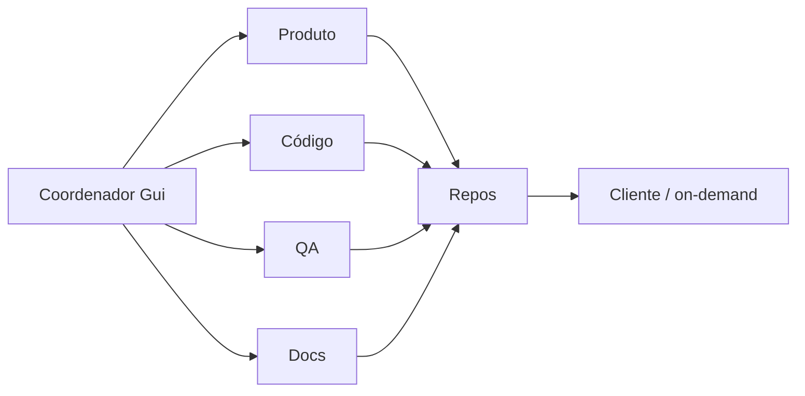

# Guilherme / Gui — Coordenador de IAs · freela on-demand

**Disponível esta semana (set/2026)** para trampo **on-demand**: landing, template SaaS, personalização, bugfix, PDF/propostas, site cliente.

**EN:** AI coordinator for digital products — multi-agent delivery. Open for **on-demand** gigs this week.

---

## On-demand (esta semana)

| Pacote | Entrega típica | Stack |
|--------|----------------|--------|
| Landing / site cliente | 24–72h | Next.js · HTML/CSS · deploy |
| Clone + marca do `comercial-template` | 2–5 dias | Next.js · Auth · Prisma · PDF |
| Ajuste / bugfix / feature curta | 1–3 dias | TS · React · Android (Kotlin) |
| Playbook multiagente (docs) | sob escopo | prompts · papéis · QA |

**Como contratar:** abra uma [issue no comercial-template](https://github.com/lughlammas/comercial-template/issues) com escopo + prazo, ou fale pelo CTA do [portfolio](https://lughlammas.github.io/#on-demand).

---

## Stack

- **Web:** Next.js, React, TypeScript, Tailwind
- **Dados / auth:** Prisma, NextAuth, SQLite/Postgres
- **Entrega:** Docker, PDF (`@react-pdf/renderer`), GitHub
- **Mobile:** Kotlin / Android (Êxodus file manager — case)
- **Processo:** coordenação multiagente (produto · código · QA · docs)
- **Comunidade:** [Stack Overflow](https://stackoverflow.com/) — perfil em criação (`lughlammas`)

---

## Projetos em destaque

| Projeto | Para quê | Link |
|---------|----------|------|
| **comercial-template** | Base SaaS B2B (auth, dashboard, propostas, PDF) | [repo](https://github.com/lughlammas/comercial-template) |
| **ai-coordinator-portfolio** | Playbooks de coordenação de IAs | [repo](https://github.com/lughlammas/ai-coordinator-portfolio) |
| **logosdigital** | Site Next.js / presença | [repo](https://github.com/lughlammas/logosdigital) |
| **solucaoinfo1.0** | Site cliente (HTML/CSS/JS) | [repo](https://github.com/lughlammas/solucaoinfo1.0) |

Portfolio: **[lughlammas.github.io](https://lughlammas.github.io)**

---

## Como trabalho

Coordenação de **assistants / agentes de IA** sob direção humana — sem time fictício.

---

## Contato

- **GitHub:** [@lughlammas](https://github.com/lughlammas)
- **Portfolio:** [lughlammas.github.io](https://lughlammas.github.io)
- **Issues (pedido de job):** [comercial-template/issues](https://github.com/lughlammas/comercial-template/issues)
- **Stack Overflow:** criar/vincular perfil `lughlammas` (em andamento)

Pix / valores sob escopo — resposta rápida esta semana.
