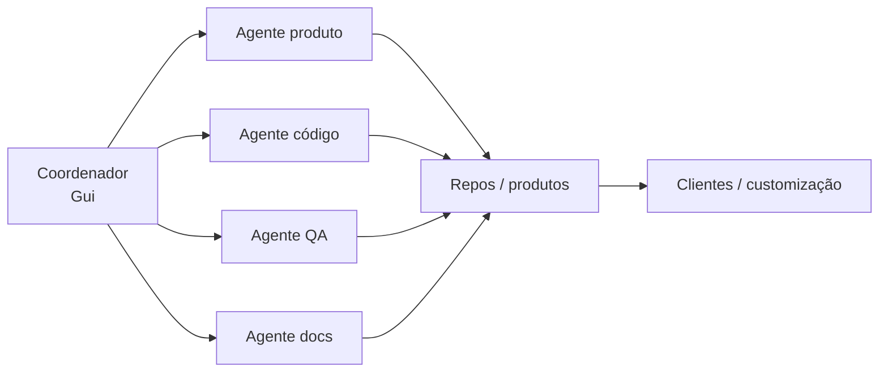

# Guilherme / Gui — Coordenador de IAs para produtos digitais

**EN:** AI coordinator for digital products — I orchestrate multiple assistants to ship SaaS, commercial templates, and client sites.

Orquestro **múltiplos agentes de IA** (produto, código, QA, documentação) para entregar software comercial: templates SaaS reutilizáveis, sites de cliente e personalizações sob demanda.

---

## Como trabalho

O coordenador define escopo, prioridades e critério de aceite. Os agentes especializam-se em discovery, implementação, verificação e documentação. O resultado vai para repositórios versionados e, quando faz sentido, para instalação e manutenção no cliente.

Não invento time humano fictício: a coordenação é de **assistants / agentes de IA** sob direção humana.

---

## Projetos em destaque

| Projeto | Descrição | Link |
|---------|-----------|------|
| **comercial-template** | Template SaaS B2B (auth, dashboard, propostas, PDF). Base para clonar produtos comerciais. | [repo](https://github.com/lughlammas/comercial-template) |
| **logosdigital** | Site Next.js — presença digital / landing. | [repo](https://github.com/lughlammas/logosdigital) |
| **solucaoinfo1.0** | Site de avaliação para cliente (HTML/CSS/JS) — assistência técnica / TI. | [repo](https://github.com/lughlammas/solucaoinfo1.0) |

Portfolio completo: **[lughlammas.github.io](https://lughlammas.github.io)**

---

## Serviços / modelo de receita

| Serviço | O que inclui |
|---------|----------------|
| **Instalação personalizada** | Deploy do template (ou clone) com marca, domínio e variáveis do cliente |
| **Configuração / personalização** | Fluxos, textos, PDF, schema e integrações pontuais |
| **Manutenção** | Ajustes, correções e evolução sob acordo |

Valores sob consulta — tabela ilustrativa no [site](https://lughlammas.github.io/#oferta).

---

## Stack

- **Frontend:** Next.js, React, TypeScript, Tailwind CSS
- **Backend / dados:** NextAuth, Prisma, SQLite / Postgres
- **Entrega:** Docker, PDF (`@react-pdf/renderer`), GitHub
- **Processo:** coordenação multiagente, playbooks de clone e customização

---

## Formação

Repos de curso (EBAC frontend e afins) ficam no GitHub como histórico de formação — jQuery, Bootstrap, clones, exercícios. Não são o foco comercial; o foco é o pipeline de produtos e templates.

---

## Contato

- **GitHub:** [@lughlammas](https://github.com/lughlammas)
- **E-mail:** TODO
- **LinkedIn:** TODO

Quer um micro-SaaS ou site comercial a partir do template? Abra uma issue no [comercial-template](https://github.com/lughlammas/comercial-template) ou use o CTA do [portfolio](https://lughlammas.github.io).
