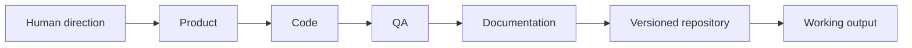

# Guilherme Cavalcanti

**Independent Developer · Applied AI · AI Coordination**

I design and coordinate AI-assisted workflows across product, code, testing, research, and documentation, with a focus on turning concepts into working software.

**ARBOCK LABS** — an independent software and applied-AI lab currently being structured.

## What I do

- Applied AI workflows and AI-assisted product development
- Software prototyping
- Multi-agent coordination across product, code, QA, and documentation
- Web and Android application development
- Technical experimentation, testing, and iterative delivery

AI systems remain under human direction, review, and accountability throughout the development process.

## Selected Work

### SHERLOCK

A visual chess investigation and analysis environment integrating a React web interface, WebSocket controller, UCI adapter, and native engine execution. Its Android version connects a WebView interface to a native engine process.

[Repository](https://github.com/lughlammas/sherlock) · [Android release v0.1.3](https://github.com/lughlammas/sherlock/releases/tag/v0.1.3)

### Lughnasadh 0.4.0 — Fourth Harvest

An original C++20 UCI chess engine developed for study, analysis, and engine experimentation. The source covers move generation, position handling, evaluation, search, and a transposition table, with CMake builds and reproducible perft validation in GitHub CI.

[Repository](https://github.com/lughlammas/lughnasadh)

### comercial-template

A full-stack Next.js application with NextAuth authentication, user-scoped Prisma persistence, client and proposal workflows, server-generated PDFs, and Docker configuration.

[Repository](https://github.com/lughlammas/comercial-template)

### Êxodus

An open-source Android file manager focused on local file operations, ZIP creation, sharing, and zero advertising. Released under the MIT license.

[Repository](https://github.com/lughlammas/exodus) · [Release v1.0.0](https://github.com/lughlammas/exodus/releases/tag/v1.0.0)

### AI Coordinator Portfolio

Documented methodology for human-directed AI coordination across product, implementation, QA, handoffs, and documentation, including playbooks, role definitions, prompts, and acceptance criteria.

[Repository](https://github.com/lughlammas/ai-coordinator-portfolio)

## How I work

Define the problem → decompose work → coordinate tools and agents → inspect results → test → document → ship.

```mermaid
flowchart LR
  H["Human direction"] --> P["Product"]
  P --> C["Code"]
  C --> Q["QA"]
  Q --> D["Documentation"]
  D --> R["Versioned repository"]
  R --> O["Working output"]
```

Human review and testing guide each iteration, with decisions and changes recorded in versioned repositories.

## Technologies

- **Web:** React · Next.js · TypeScript · Tailwind CSS · Node.js · Prisma · NextAuth
- **Systems / engines:** C++20 · CMake · UCI integration
- **Android:** Kotlin · Android
- **Engineering workflow:** Docker · Git · GitHub · GitHub Actions · testing / CI
- **AI:** AI-assisted development · human-directed multi-agent coordination

## Languages

- Portuguese — Native
- English — Fluent
- Spanish — Fluent

## Available for project work

I take on focused technical engagements where understanding, experimentation, coordination and delivery matter. I can join an existing codebase, develop an early concept, or own a defined deliverable.

### Typical engagements

- Audit, restructure and consolidate repositories, code, builds and technical assets
- Build functional prototypes; prepare them for documented releases
- Coordinate AI-assisted sprints and improve documentation, QA and delivery
- Prepare projects for GitHub, handoff or technical review

### Areas of work

Applied AI · prototyping · developer tooling · web and Android · technical documentation · project execution · multi-agent coordination.

### Engagement formats

Fixed-scope projects · short sprints · fractional / part-time work · project-based consulting · prototype-to-delivery engagements · temporary team support.

For project discussions, contact me through GitHub or the links below.

## Typical problems I can take on

**“I have a working prototype but the repository is a mess.”**  
Audit, restructure, document and prepare it for continuation or release.

**“I need to test whether an idea can become software.”**  
Build and validate a focused technical prototype.

**“My AI-assisted project is producing code but lacks coordination.”**  
Structure roles, QA, handoffs and human review.

**“I have an existing project that needs a short technical push.”**  
Diagnose its current state and deliver a defined sprint outcome.

## Contact

- GitHub: [@lughlammas](https://github.com/lughlammas)
- Portfolio: [lughlammas.github.io](https://lughlammas.github.io)

Open to international software, applied AI, prototyping, and AI-coordination opportunities.
