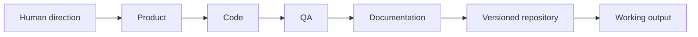

# Guilherme Cavalcanti

**Independent Developer · Applied AI · AI Coordination**

I design and coordinate AI-assisted workflows across product, code, testing, research, and documentation, with a focus on turning concepts into working software.

**ARBOCK LABS** — an independent software and applied-AI lab currently being structured.

## What I do

- Applied AI workflows and AI-assisted product development
- Software prototyping
- Multi-agent coordination across product, code, QA, and documentation
- Web and Android application development
- Technical experimentation, testing, and iterative delivery

AI systems remain under human direction, review, and accountability throughout the development process.

## Selected Work

### S H E R L O C K

A visual chess investigation and analysis environment built around the Lughnasadh UCI chess engine. Its React interface connects through a WebSocket controller and a UCI adapter; the Android version uses a WebView interface with a native engine process.

[Repository](https://github.com/lughlammas/sherlock) · [Android release v0.1.3](https://github.com/lughlammas/sherlock/releases/tag/v0.1.3)

### Êxodus

An open-source Android file manager with local file operations, ZIP creation and sharing, and no advertising. Released under the MIT license.

[Repository](https://github.com/lughlammas/exodus) · [Release v1.0.0](https://github.com/lughlammas/exodus/releases/tag/v1.0.0)

### Tron — o legado

An experimental Android and web application for chess-analysis interface research, with a Vite and TypeScript frontend and an Android wrapper.

[Repository](https://github.com/lughlammas/tron-o-legado) · [Android release v0.2.0](https://github.com/lughlammas/tron-o-legado/releases/tag/v0.2.0)

### AI Coordinator Portfolio

Documented methodology for coordinating AI agents across product development, handoffs, QA, and delivery, including playbooks, role definitions, and prompts.

[Repository](https://github.com/lughlammas/ai-coordinator-portfolio)

## How I work

Define the problem → decompose work → coordinate tools and agents → inspect results → test → document → ship.

```mermaid
flowchart LR
  H["Human direction"] --> P["Product"]
  P --> C["Code"]
  C --> Q["QA"]
  Q --> D["Documentation"]
  D --> R["Versioned repository"]
  R --> O["Working output"]
```

Human review and testing guide each iteration, with decisions and changes recorded in versioned repositories.

## Technologies

- **Web:** React · Next.js · TypeScript · Tailwind CSS · Prisma · NextAuth
- **Android:** Kotlin · Android
- **Development and integration:** Docker · Git · GitHub · UCI integration

My workflow includes AI-assisted development and multi-agent coordination.

## Languages

- Portuguese — Native
- English — Fluent
- Spanish — Fluent

## Contact

- GitHub: [@lughlammas](https://github.com/lughlammas)
- Portfolio: [lughlammas.github.io](https://lughlammas.github.io)

Open to international software, applied AI, prototyping, and AI-coordination opportunities.
